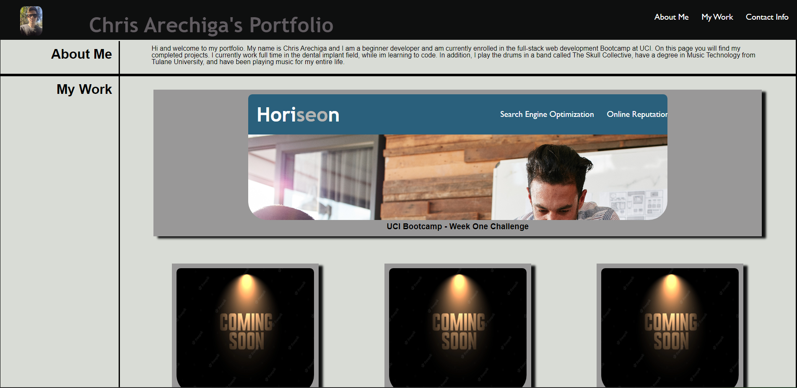

# week-two-challenge
UCI boot camp week two challenge, personal Porftolio
## Project Description 
The objective for this project was to create a personal Portfolio for professional use.
Using the foundations I have built in class on HTML and CSS, I designed a portfoio to showcase my works and projects to future employers.
The focus was to use the skills to create an application that showcases my understanding of CSS to both clearly present my works, as well as making it personally unique, stylelistically.
The porject is deesigned to be continually updated as i complete more works.

## Credits
The structure of the project was laid out in the instuctions of my class challenge. And reset.css file was taken from class activity.

## Deployment

You can find the deployed project here: https://carechiga.github.io/week-two-challenge/